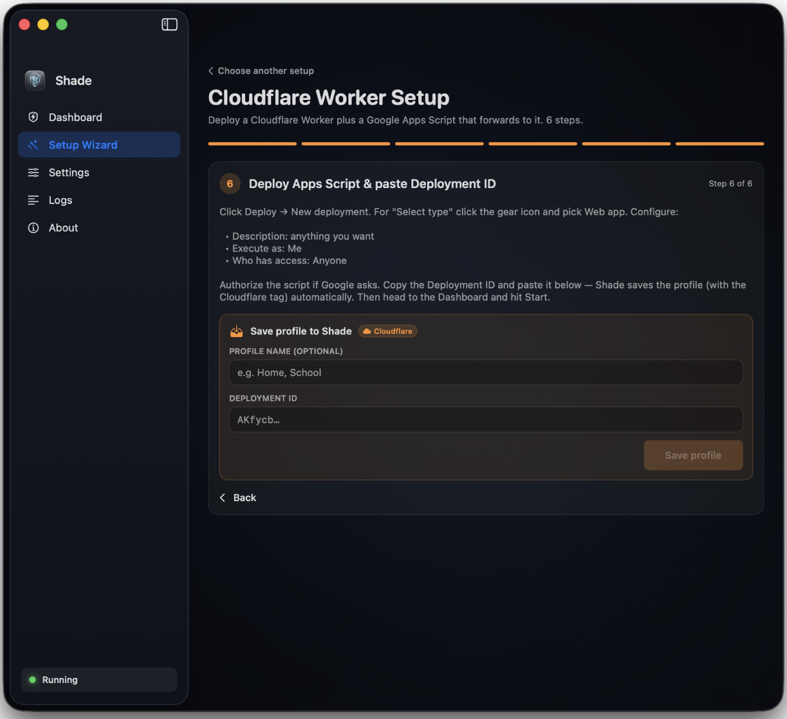
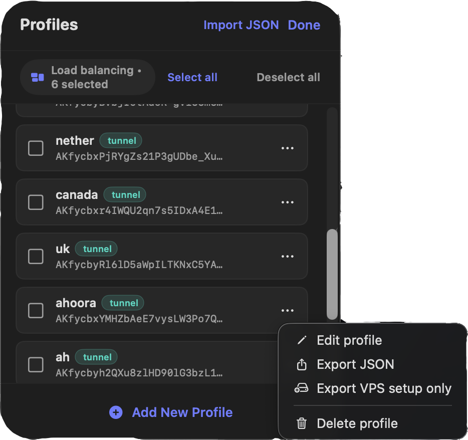

# Shade

**Shade** is a Mac app that helps you browse and use apps more reliably when your network is slow, picky, or blocking things. Everything is designed to be **guided**: you follow steps in the app instead of editing files by hand.

<table align="center">
  <tr>
    <td width="50%" align="center" valign="top">
      
    </td>
    <td width="50%" align="center" valign="top">
      
    </td>
  </tr>
  <tr>
    <td width="50%" align="center" valign="top">
      
    </td>
    <td width="50%" align="center" valign="top">
      
    </td>
  </tr>
</table>

[English] | [فارسی](README_FA.md)

---

## What you get

- **A setup wizard** — Shade asks simple questions and builds your settings for you.
- **One place to turn it on or off** — menu bar controls and a clear dashboard so you always know if Shade is active.
- **“Full tunnel” when you need it** — a stronger mode for apps that are fussy about how traffic leaves your Mac.
- **Share your working setup** — export a profile from a Mac that already works and import it on another Mac (or share with someone you trust) so nobody has to retype long settings.
- **Phones and tablets** — point a SOCKS app (for example **v2box** on iPhone or Android) at your Mac’s Shade connection when you want that device to use the same path.
- **Stays responsive** — Shade spreads work across multiple paths so one slow hop doesn’t ruin the whole session.
- **Built-in ad blocking** — blocks known ad and tracker domains through the proxy (on by default; turn off in **Settings** if a site misbehaves).
- **Optional speed check** — when the app offers it, you can run a quick test to find a snappier connection on difficult networks.

---

## How to use Shade (simple path)

1. **Install Shade** — download the Mac app from **[GitHub Releases](https://github.com/g3ntrix/Shade/releases)**. You need **macOS 13 or newer** (Apple Silicon and Intel are both supported).
2. **Open the app** and start the **Setup Wizard**. Read each screen; it explains what to enter and checks that things look right before saving.
3. **Finish the wizard** — Shade writes your configuration automatically. You shouldn’t need to open config files for a normal setup.
4. **Connect** from the dashboard or menu bar. If the wizard suggested turning on the system proxy, do that when you’re ready to route your Mac’s traffic through Shade.
5. **Optional:** turn on **full tunnel** mode in the app if some apps still won’t connect the usual way.
6. **Optional:** use **Share / Export** to create a profile, then **Import** it on another Mac to copy the same working setup in a few taps.

If anything is unclear, use the **in-app setup guide** — it’s there to walk you through the same flow with pictures and reminders.

---

## Support development

If Shade helps you stay connected, consider supporting the project:

- **TON**: `UQCriHkMUa6h9oN059tyC23T13OsQhGGM3hUS2S4IYRBZgvx`
- **USDT (BEP20)**: `0x71F41696c60C4693305e67eE3Baa650a4E3dA796`
- **TRX (TRON)**: `TFrCzU7bDey9WSh3fhqCBqhaiMzr8VhcUV`
