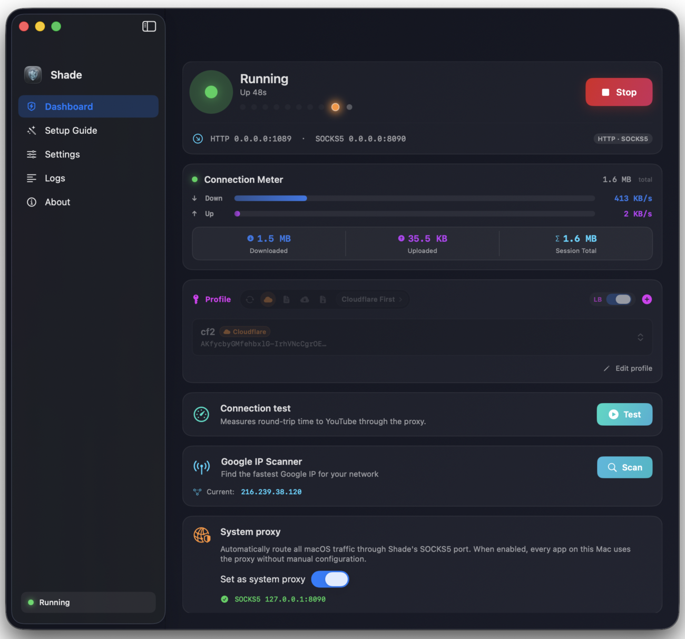
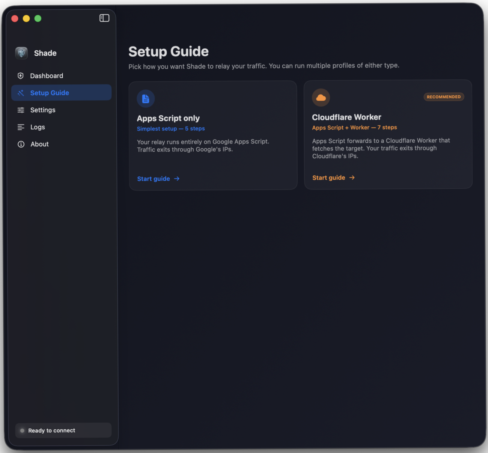
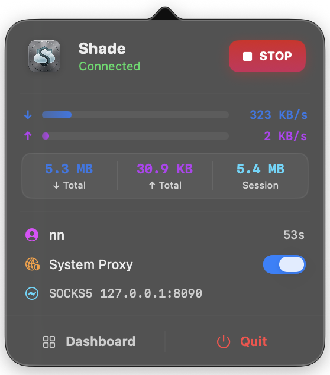

# Shade

**Shade** یک کلاینت پراکسی پرمیوم و ضد DPI برای macOS است که جهت هدایت ترافیک از طریق رله‌های **Google Apps Script** طراحی شده است. این برنامه با ترکیب هسته قدرتمند پایتون و رابط کاربری مدرن SwiftUI، تجربه‌ای روان و امن را برای عبور از سد فیلترینگ فراهم می‌کند.

  
  
  

[English](README.md) | [فارسی]

## امکانات کلیدی

- **مقاومت بالا در برابر DPI**: استفاده از تکنیک SNI Fronting بر روی زیرساخت گوگل برای دور زدن فیلترینگ هوشمند.
- **توزیع بار هوشمند (Load Balancing)**: توزیع ترافیک بین چندین اسکریپت مختلف به صورت همزمان جهت افزایش سرعت و پایداری.
- **رابط کاربری پرمیوم**: تجربه‌ای بومی و سبک در macOS با استفاده از SwiftUI، دارای جلوه‌های شیشه‌ای (Glassmorphism) و انیمیشن‌های زنده.
- **کنترل از منوبار**: مشاهده سرعت لحظه‌ای و کنترل اتصال مستقیماً از نوار منوی سیستم.
- **تنظیمات بدون دردسر**: نصب خودکار گواهی SSL و تنظیم خودکار پراکسی کل سیستم تنها با یک کلیک.
- **اسکنر آی‌پی اختصاصی**: یافتن سریع‌ترین آی‌پی‌های لبه گوگل متناسب با شبکه اینترنت شما.

## شروع سریع

۱. **استقرار رله**: کد `Code.gs` را در Google Apps Script به صورت Web App منتشر کنید.
۲. **افزودن پروفایل**: مشخصات **Script ID** و **Auth Key** را در Shade وارد کنید.
۳. **اتصال**: دکمه **Start** را بزنید و برای عبور کل ترافیک سیستم، گزینه **Set as system proxy** را فعال کنید.

## نگاه فنی

- **پورت‌های محلی**: HTTP (`1080`) و SOCKS5 (`8080`) به صورت پیش‌فرض.
- **معماری**: نسخه Universal با پشتیبانی بومی از پردازنده‌های Apple Silicon و Intel.
- **امنیت**: تونل امن TLS 1.3 به لبه شبکه گوگل.

---

## حمایت از پروژه

اگر Shade به برقراری ارتباط شما کمک می‌کند، می‌توانید از توسعه آن حمایت کنید:

- **TON**: `UQCriHkMUa6h9oN059tyC23T13OsQhGGM3hUS2S4IYRBZgvx`
- **USDT (BEP20)**: `0x71F41696c60C4693305e67eE3Baa650a4E3dA796`
- **TRX (TRON)**: `TFrCzU7bDey9WSh3fhqCBqhaiMzr8VhcUV`